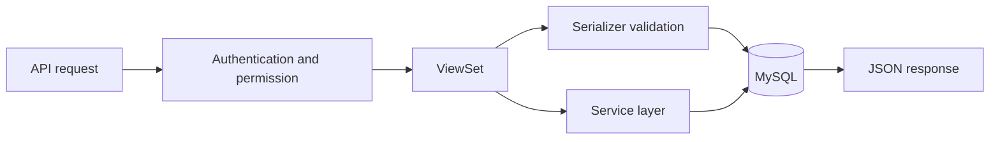
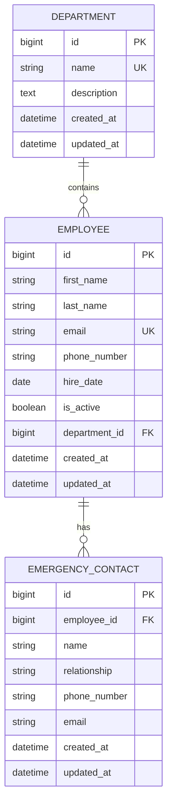

# Employee Management REST API

[](https://www.djangoproject.com/)
[](https://www.django-rest-framework.org/)
[](https://www.mysql.com/)
[](#tests-and-quality-checks)

A complete training backend built with Django, Django REST Framework, and MySQL. The API manages employees, departments, and emergency contacts while demonstrating nested routes, parent-child validation, migrations, permissions, automated testing, and query optimization.

## Project report

The goal of this project is to turn a typical employee-management requirement into a maintainable REST API. The implementation keeps HTTP handling inside viewsets, validation inside serializers, and transfer rules inside a small service layer. This separation makes the code easier to read, test, and explain during review.

### Technology stack

| Area | Technology |
| --- | --- |
| Language | Python 3.11+ |
| Web framework | Django 5.2 |
| API framework | Django REST Framework 3.16 |
| Database | MySQL 8 with `utf8mb4` |
| Authentication | DRF token and session authentication |
| Testing | Django test runner and DRF API test client |

### Request flow



### Data model



## Main features

- Employee and department CRUD endpoints
- Nested department employee read endpoints
- Emergency contact create, read, update, and delete endpoints under employees
- Manual nested URL routes with parent-scoped child lookups
- MySQL database configuration using environment variables
- Token and session authentication
- Regular users have read-only access
- Staff/admin users can create, update, delete, and transfer employees
- Employee filtering by active status and department
- Name/email search and safe ordering
- Department employee counts using database aggregation
- Employee transfer service using `transaction.atomic()` and `select_for_update()`
- Schema migrations plus a data migration
- Automated tests for success and failure cases
- Admin panel and optional demo data command

## Project structure

```text
employee_management_api/
├── database/                # MySQL database creation script
├── employee_api/            # Project settings and root URLs
├── employees/
│   ├── management/commands/ # Demo data command
│   ├── migrations/          # Schema and data migrations
│   ├── tests/               # API and business behavior tests
│   ├── models/              # Django database models
│   ├── repositories/        # Database queries only
│   ├── components/          # Business logic and use cases
│   ├── permissions.py
│   ├── serializers/         # Input validation and API output
│   ├── services.py          # Backward-compatible service wrapper
│   ├── urls.py
│   └── views/               # Thin API controllers
├── manage.py
└── requirements.txt
```

## Setup

Python 3.11 or newer is recommended.

```bash
python -m venv .venv
```

Activate the environment:

```bash
# Windows PowerShell
.venv\Scripts\Activate.ps1

# Linux or macOS
source .venv/bin/activate
```

Install packages:

```bash
pip install -r requirements.txt
```

Create a local `.env` file in the project root and add the environment variables listed in the configuration table below. Set `MYSQL_PASSWORD` to the password of your local MySQL user. The real `.env` file is ignored by Git and must not be committed.

## MySQL database setup

The project uses these local values by default:

| Setting | Value |
| --- | --- |
| Database | `employee_management_db` |
| User | `root` |
| Password | Value from `.env` |
| Host | `127.0.0.1` |
| Port | `3306` |

Make sure MySQL Server is running. Create the database from the project directory.

Linux or macOS:

```bash
mysql -u root -p < database/create_database.sql
```

Windows PowerShell:

```powershell
cmd /c "mysql -u root -p < database\create_database.sql"
```

If the `mysql` command is not available, open `database/create_database.sql` in MySQL Workbench and execute it. Then create the tables, demo data, and an admin account:

```bash
python manage.py migrate
python manage.py seed_data
python manage.py createsuperuser
python manage.py runserver
```

The `seed_data` command adds two departments and two employees. MySQL stores the database in the MySQL server, so the project does not include a `db.sqlite3` file.

The API is available at `http://127.0.0.1:8000/api/` and the admin panel at `http://127.0.0.1:8000/admin/`.

## Environment configuration

The following environment variables are supported:

| Variable | Example | Purpose |
| --- | --- | --- |
| `DJANGO_SECRET_KEY` | `a-long-random-value` | Django signing secret |
| `DJANGO_DEBUG` | `True` | Enables development debug mode |
| `DJANGO_ALLOWED_HOSTS` | `127.0.0.1,localhost` | Comma-separated hosts |
| `MYSQL_DATABASE` | `employee_management_db` | MySQL database name |
| `MYSQL_USER` | `root` | MySQL username |
| `MYSQL_PASSWORD` | `your_mysql_password` | MySQL password |
| `MYSQL_HOST` | `127.0.0.1` | MySQL server host |
| `MYSQL_PORT` | `3306` | MySQL server port |

Keep `.env` local. It is intentionally excluded from the repository so database credentials are never published.

## Authentication and permissions

Create a token for an existing user:

```bash
python manage.py drf_create_token USERNAME
```

Or send a username and password to the token endpoint:

```http
POST /api/token/
Content-Type: application/json

{
  "username": "admin",
  "password": "your-password"
}
```

Send the token with each API request:

```http
Authorization: Token YOUR_TOKEN_HERE
```

Access levels:

| User | Read | Create, update, delete, transfer |
| --- | --- | --- |
| Unauthenticated | No | No |
| Regular authenticated user | Yes | No |
| Staff or superuser | Yes | Yes |

## API endpoints

| Method | Endpoint | Description |
| --- | --- | --- |
| GET, POST | `/api/employees/` | List or create employees |
| GET, PATCH, PUT, DELETE | `/api/employees/{id}/` | Employee details and changes |
| POST | `/api/employees/{id}/transfer/` | Transfer an active employee |
| GET, POST | `/api/departments/` | List or create departments |
| GET, PATCH, PUT, DELETE | `/api/departments/{id}/` | Department details and changes |
| GET, POST | `/api/departments/{department_id}/employees/` | List employees or create one in a department |
| GET | `/api/departments/{department_id}/employees/{employee_id}/` | Read an employee through its department |
| GET, POST | `/api/employees/{employee_id}/contacts/` | List or add emergency contacts |
| GET, PATCH, DELETE | `/api/employees/{employee_id}/contacts/{contact_id}/` | Read, update, or remove a contact |
| POST | `/api/token/` | Obtain an authentication token |

Nested paths are declared directly in `employees/urls.py`; the project does not install an additional nested-router package. Their repositories use parameterized SQL and return Python lists for the nested views. The existing Phase 1 endpoints keep their original data-access code.

Nested detail lookups include both ids. For example, an employee id that belongs to Finance cannot be retrieved from `/api/departments/1/employees/{employee_id}/` when department `1` is Engineering. The API returns `404 Not Found` for a wrong parent-child pair or for a missing parent.

### Emergency contacts

Create an emergency contact as a staff user:

```http
POST /api/employees/3/contacts/
Authorization: Token YOUR_TOKEN_HERE
Content-Type: application/json

{
  "name": "John Doe",
  "relationship": "Father",
  "phone_number": "+123456789",
  "email": "john@example.com"
}
```

The employee is taken from the URL, so it is not accepted in the request body. A contact id is also checked under that employee for detail, update, and delete requests.

Employees can also be created under a department URL. The department id comes from the URL and is checked before the employee is saved:

```http
POST /api/departments/1/employees/
Authorization: Token YOUR_TOKEN_HERE
Content-Type: application/json

{
  "first_name": "Rana",
  "last_name": "Khalil",
  "email": "rana@example.com",
  "hire_date": "2025-02-01"
}
```

```http
GET /api/departments/1/employees/
GET /api/departments/1/employees/4/
GET /api/employees/3/contacts/
GET /api/employees/3/contacts/1/
PATCH /api/employees/3/contacts/1/
DELETE /api/employees/3/contacts/1/
```

### Employee filters

```http
GET /api/employees/?active=true
GET /api/employees/?department=2
GET /api/employees/?search=lina
GET /api/employees/?ordering=last_name
GET /api/employees/?ordering=-hire_date
```

Allowed ordering fields are `first_name`, `last_name`, `hire_date`, and `created_at`.

## Example requests

Create an employee as an admin:

```http
POST /api/employees/
Authorization: Token YOUR_TOKEN_HERE
Content-Type: application/json

{
  "first_name": "Maya",
  "last_name": "Saleh",
  "email": "maya@example.com",
  "phone_number": "+970 599 111 222",
  "hire_date": "2025-01-05",
  "is_active": true,
  "department": 1
}
```

Successful response:

```json
{
  "id": 3,
  "first_name": "Maya",
  "last_name": "Saleh",
  "full_name": "Maya Saleh",
  "email": "maya@example.com",
  "phone_number": "+970 599 111 222",
  "hire_date": "2025-01-05",
  "is_active": true,
  "department": 1,
  "department_name": "Engineering",
  "created_at": "2026-09-19T12:00:00Z",
  "updated_at": "2026-09-19T12:00:00Z"
}
```

Transfer an employee:

```http
POST /api/employees/3/transfer/
Authorization: Token YOUR_TOKEN_HERE
Content-Type: application/json

{
  "department_id": 2
}
```

Example validation response:

```json
{
  "employee": ["Inactive employees cannot be transferred."]
}
```

## Migrations

The project includes the original employee migrations and a nested-resource migration:

1. `0001_initial.py` creates the models, relationships, indexes, and constraints.
2. `0002_employee_phone_number.py` demonstrates adding a field after the initial schema.
3. `0003_normalize_existing_data.py` is a data migration that cleans department names and lowercases stored emails.
4. `0004_emergency_contact.py` creates the one-to-many employee emergency contact table.

Useful commands:

```bash
python manage.py showmigrations
python manage.py makemigrations
python manage.py migrate
```

## Tests and quality checks

Run all tests:

```bash
python manage.py test --settings=employee_api.test_settings
```

The suite checks CRUD behavior, duplicate emails, filters, department counts, nested parent-child scoping, emergency contact validation, permissions, transfers, rollback-safe failure cases, and the optimized employee list query count. It uses a temporary isolated database so test cleanup cannot delete local MySQL data.

The suite contains 29 tests. Run the command above to check the current result in your environment.

Additional checks:

```bash
python manage.py check --settings=employee_api.test_settings
python manage.py makemigrations --check --dry-run --settings=employee_api.test_settings
```

## Query optimization note

The employee serializer returns the department name. Without optimization, listing employees can cause one extra department query for every employee, which is the N+1 problem. `EmployeeViewSet.get_queryset()` uses `select_related("department")` so the employee and department data are loaded in one joined query.

Pagination runs a count query plus one employee query. Token authentication adds one user/token query, so the test confirms the endpoint stays at three queries even when employee rows are serialized.

Department totals are calculated with `Count()` and a filtered `Count()` in the database. This avoids loading all employees into Python just to calculate the two totals. The employee model also has indexes for hire date, active status, and the common department/active combination.

## Important design decisions

- `PROTECT` prevents deleting a department that still owns employee records.
- Email addresses are normalized to lowercase and checked case-insensitively.
- Future hire dates and invalid phone formats are rejected by serializer validation.
- Employee transfer runs inside `transaction.atomic()` and locks the employee row with `select_for_update()`.
- Filtering and ordering use explicit allowlists so unsupported query values return clear errors.
- List endpoints use pagination to keep responses manageable as data grows.

## Requirement coverage

| Requirement | Implementation |
| --- | --- |
| Employee and department models | `employees/models/` |
| EmergencyContact model and employee relationship | `employees/models/emergency_contact_model.py` |
| Nested URL declarations | Explicit paths in `employees/urls.py` |
| Parent-scoped employee and contact resources | `employees/views/` and `employees/components/` |
| Schema and data migrations | `employees/migrations/` |
| CRUD endpoints | `employees/views/` controllers and router URLs |
| Validation | `employees/serializers/` |
| Authentication and two access levels | DRF settings and `employees/permissions.py` |
| Transactional employee transfer | `employees/components/employee_component.py` |
| Filtering, search, and ordering | Employee component and repository |
| Query optimization | Repositories using `select_related()` and annotations |
| Automated tests | `employees/tests/` |
| Setup and API documentation | This README and `docs/api_examples.http` |

## Troubleshooting

### `manage.py` cannot be found

The ZIP contains an outer folder. Move into the application directory first:

```powershell
cd .\employee_management_api
```

### `mysql` is not recognized

Run the SQL file from MySQL Workbench, or add the MySQL `bin` directory to the Windows `PATH`.

### Access denied for MySQL user

Update `MYSQL_USER` and `MYSQL_PASSWORD` in `.env` so they match the account used by MySQL Workbench.

### PowerShell does not display password characters

This is normal. PowerShell records the password while keeping the prompt blank.

## Suggested Git workflow

For a real training submission, commit the work gradually instead of uploading one final commit:

```text
feature/project-setup
feature/employee-model
feature/department-model
feature/employee-api
feature/department-api
feature/authentication
feature/employee-transfer
test/api-tests
perf/query-optimization
```

Each branch should contain a focused change and its tests, then be opened as a pull request before merging.
